## 开发环境

openCH 赤菟 支持 MounRiver Studio (MRS) ， RT-Thread Studio 亦或是CMake开发

### `firmware` 例程的开发环境

| 例程名                             | 开发环境         |
| ---------------------------------- | ---------------- |
| Camera                             | MRS              |
| Mic_UART                           | MRS              |
| IIC_Sensor                         | MRS              |
| Integrated_Test                    | MRS              |
| Record_Play                        | MRS              |
| USART/BLE_Serial                   | MRS              |
| USART/Wifi_ESP8266                 | MRS              |
| USART/UART_DMA                     | MRS              |
| SPI_Flash                          | MRS              |
| KEY_TEST                           | MRS              |
| GreedySnake_Net\GreedySnake_Client | MRS              |
| GreedySnake_Net\GreedySnake_Server | MRS              |
| TcpClient                          | MRS              |
| CH32V307_RTT_VC_RC_by_es8388       | RT-Thread Studio |

### MounRiver Studio (MRS)

大多数例程使用 MRS 开发：[MRS 上手教程](https://verimake.com/d/12-ch32v307-mrs)  【[视频](https://www.bilibili.com/video/BV1wq4y1m7JD/)】  

MRS 的介绍和软件资源在：[MRS 官网](http://www.mounriver.com/)  

#### 基于本仓库的 MRS 例程建立新项目

本仓库中 MRS 例程的部分依赖文件放置于 'SRC' 文件夹中，单独复制例程到其它位置可能无法使用。 

可用以下方法基于本仓库例程建立新项目：（本仓库的结构与沁恒官方的 CH32V307 `EVT` 类似，下面的方法也适用于 `EVT` 中的例程）  

##### 方法一 在例程旁边建立项目（推荐）

以此方法建立的项目不可移动或复制到其它位置使用。  

此处将示范以 `UART_Basic` 为基础，建立新项目：

1. 打开 `UART_Basic` 例程，在 `项目资源管理器` 中 右击 `UART_Basic`，选择 `复制`。（或者使用 `Ctrl C`)  
   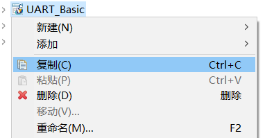
2. 右击空白处，选择 `粘贴` （或者使用 `Ctrl V`)  
   
3. 在弹出的对话框中修改项目名称，取消勾选 `使用缺省位置` 后，点击 `浏览`  
   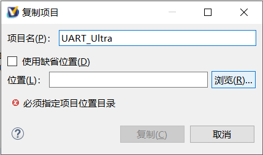
4. 到本项目的上一级目录中（此处是 `UART_Basic` 所在的 `USART` 文件夹中），新建文件夹并改名为项目名称  
   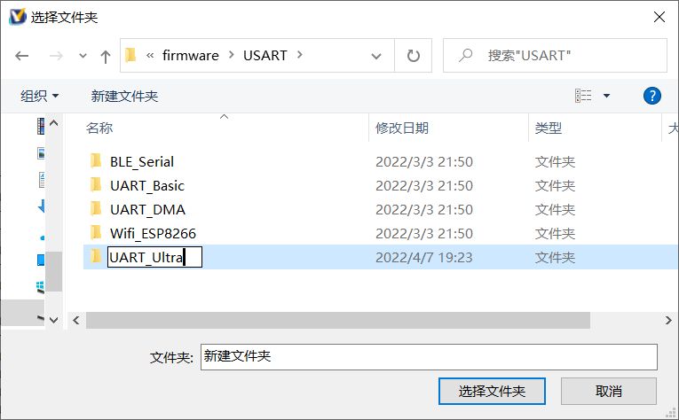
5. 选择新文件夹，返回对话框，点击 `复制`，就完成了。  
   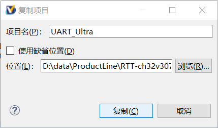
6. 新项目编译通过  
   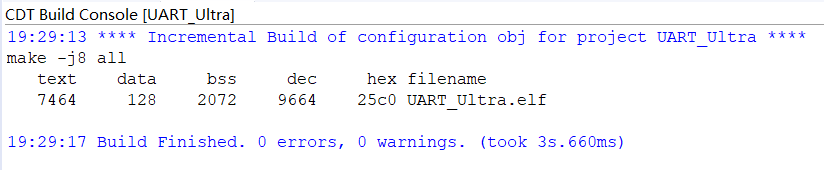

##### 方法二 使用 MRS 的导出功能

以此方法导出的项目与原项目同名，可以移动或复制到其它位置使用。  
此处示范导出 `UART_Basic`：

1. 打开 `UART_Basic` 例程，在 `项目资源管理器` 中 右击 `UART_Basic`，选择 `导出`。  
   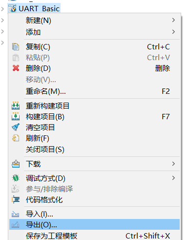
2. 在弹出的对话框中选择 `常规` 分组中的 `文件系统`，点击 下一步  
   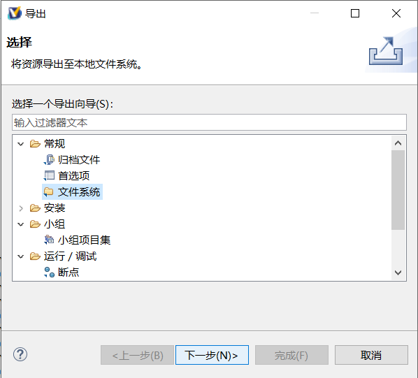
3. 选择 `UART_Basic`，在 `选项` 中勾选 `创建文件的目录结构` 和 `解析并导出已连接资源`；再点击 `浏览` ，选择项目导出位置  
   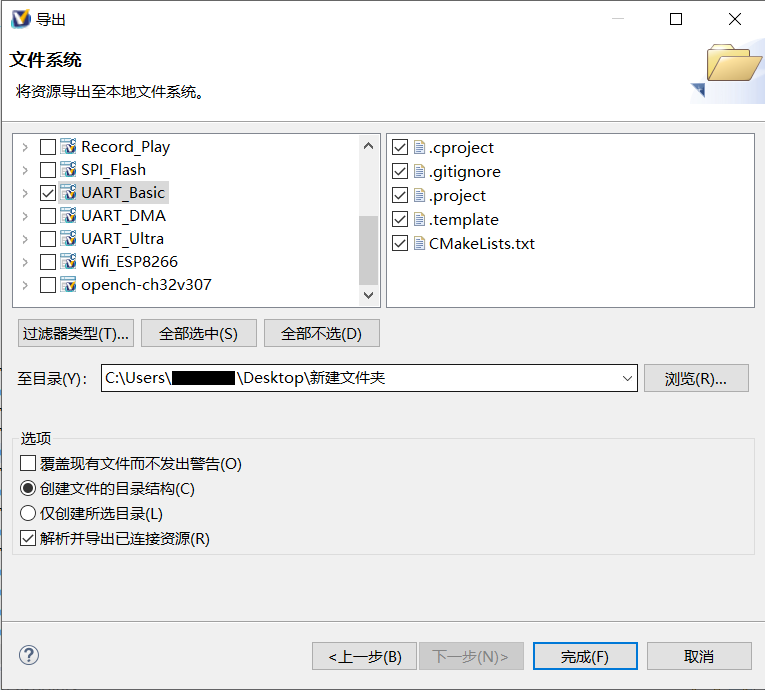
4. 点击 `完成`，即可完成项目导出。导出的项目包含所有的依赖文件。  
   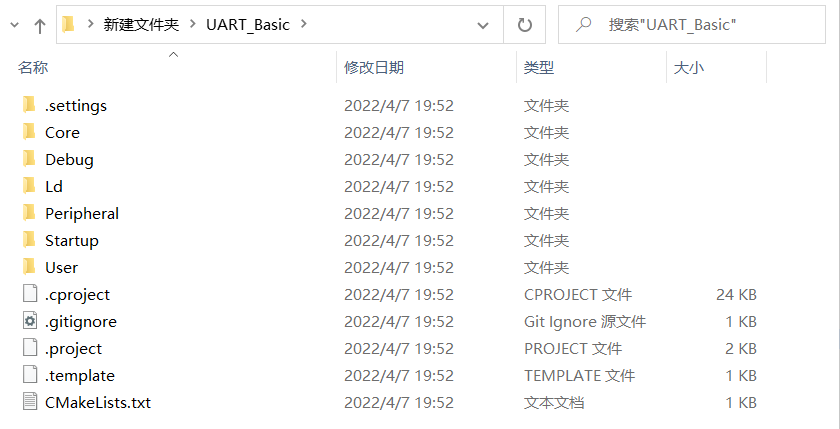
5. 导出的项目没有项目入口，可以通过 MRS 的 `加载` 功能打开（`文件` -> `加载`）。注意，加载的项目会覆盖 `项目资源管理器` 中的同名项目。  
   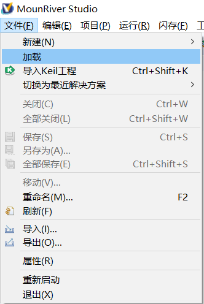
6. 在弹出的对话框中选择 `工程`，点击 `浏览`  
   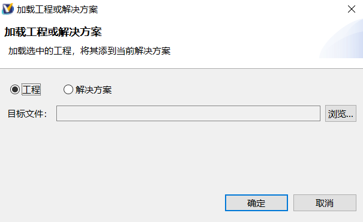
7. 到导出的项目文件夹中，选择根目录下的 `.projuct` 文件，点击 `打开`  
   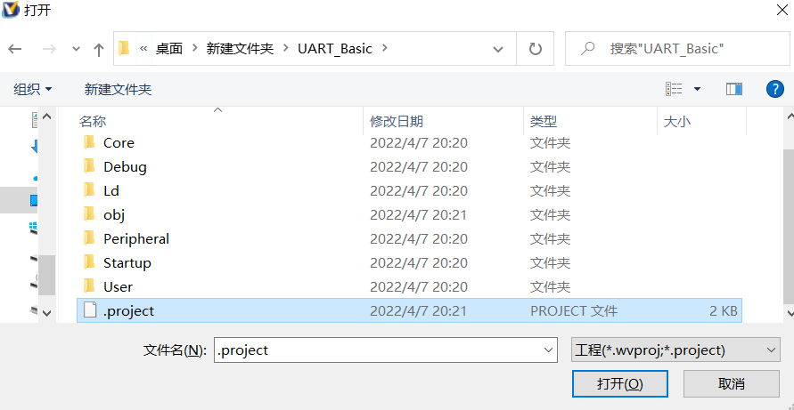
8. 返回对话框，点击 `确定`。如提示覆盖相同名称的工程，可选 `是`  
   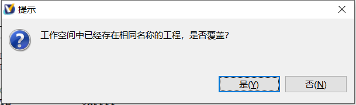
9. 项目已导入，但一些文件夹仍处于未链接状态（带感叹号`!`）。需要将它们从项目中删除  
   
10. 此时编译，项目下会多出一些文件夹，且编译可以通过  
   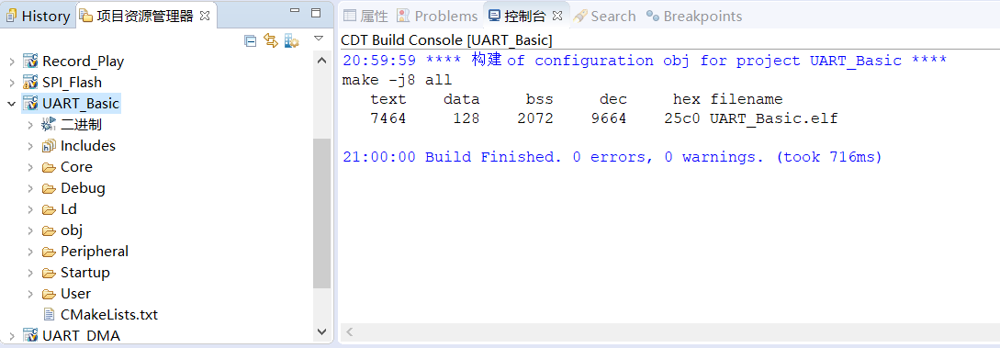

### RT-Thread Studio

基于 RT-Thread 操作系统的工程可以使用 RT-Thread Studio 开发  
[RT-Thread Studio 编译 语音识别例程](https://verimake.com/d/13-ch32v307-2021rtt-demo) 【[视频](https://www.bilibili.com/video/BV1bL4y1n797)】  
[RT-Thread Studio 下载](https://www.rt-thread.org/page/studio.html)  

### CMake

配置好 [`CMake`](https://cmake.org/) 和 [`ninja`](https://ninja-build.org/) , 开启你的赤菟之旅.

* 键入`make build APP=Integrated_Test`编译工程，二进制文件将输出到`./cmake_output`路径下.`APP`参数替换成你想操作的工程
* 键入`make program APP=Integrated_Test`将二进制文件下载至 赤菟。
* 键入`make build_elipse APP=Intergrated_Test`输出eclipse工程到`./build.eclipse`路径，可直接导入MRS，RTT-studio等eclipse环境开发。

_详细参考 : [CH32V307教程 [番外] [开发环境-CMake] 赤菟CH32V307](https://verimake.com/d/14-ch32v307-cmake-ch32v307)_

## 开发资源

* [openCH 赤菟开发板原理图](./doc/SCH_openCH_CH32V307_Board.pdf)
* [CH32V307 介绍页面 (WCH)](http://www.wch.cn/products/CH32V307.html)
* [CH32V307 沁恒官方例程（用于赤菟开发板时需修改）](http://www.wch.cn/downloads/CH32V307EVT_ZIP.html)  
* [CH32V307 芯片手册 (WCH)](http://www.wch.cn/downloads/CH32V20x_30xDS0_PDF.html)
* [CH32V307 参考手册 (WCH)](http://www.wch.cn/downloads/CH32FV2x_V3xRM_PDF.html)
