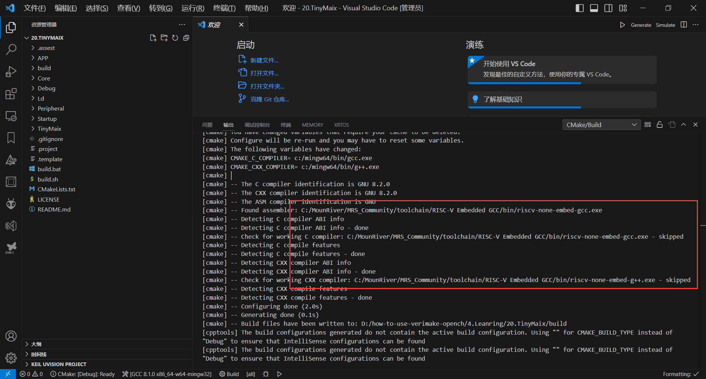
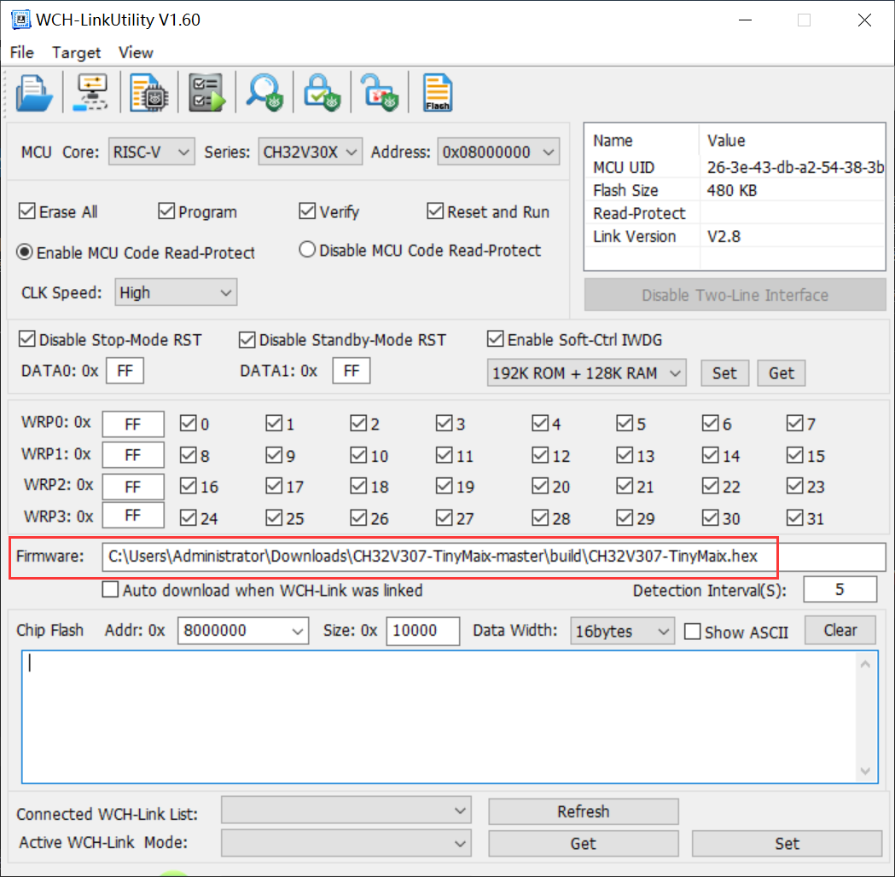

[TinyMaix](https://github.com/sipeed/TinyMaix) 

##### env：riscv-none-embed-gcc

安装 CMake。

安装 MRS，将工具链添加至环境变量中。

`C:\MounRiver\MRS_Community\toolchain\RISC-V Embedded GCC\bin`

#### 编译

① 

CMakeTools 自动配置编译器。



②

将 `ninja.exe` 所在路径添加至环境变量中

```shell
mkdir build & cd build
cmake .. -G "Ninja" # generate cmake
ninja # build
```

#### 烧录

打开烧录工具 `C:\MounRiver\MRS_Community\ExTool\SWDTool\WCH-LinkUtility.exe`。

选择固件按 F10 烧录。




