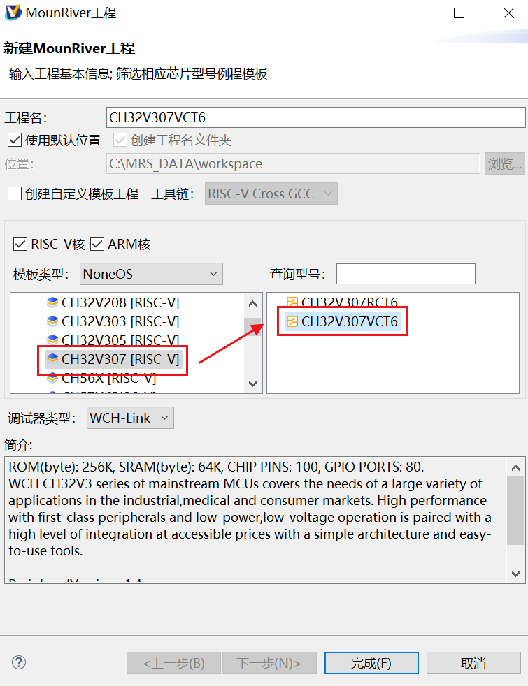

# hardware_verimake_opench_ch32v307

refer: https://verimake.com/d/37-opench-ch32v307-risc-v

env: MounRiverStudio， [MRS](http://mounriver.com/download) 

bilibili：https://space.bilibili.com/356383684

### board_opench_ch32v307


* CH32V307VCT6
* ES8388 音频采集与播放
* AP3216C 距离与环境光传感器 (ALS&PS)
* 128 Mbit 板载 Flash
* Type-C USB 接口
* 板载 WCH-Link 调试器
* 两个用户 LED，一个五向开关 和 三个用户按键，支持睡眠唤醒
* 温湿度传感器
* 六轴重力与加速度传感器
* 硬件 TF 卡 (micro-SD) 接口
* 硬件 DVP 摄像头接口，支持 OV2640 模组
* 1.33 寸 240x240 分辨率 LCD 屏，主控 ST7789，FSMC 控制
* 11 个拓展 GPIO 端口
* CH9141 BLE 透传模组，主从一体

### CH32V307VCT6


* RISC-V4F 处理器，最高 144MHz 系统主频
* 支持单周期乘法和硬件除法，支持硬件浮点运算 ( FPU )
* 64 KB SRAM，256 KB Flash
* 供电电压：2.5/3.3 V，GPIO 单元独立供电
* 多种低功耗模式：睡眠、停止、待机
* 上/下电复位、可编程电压检测器
* 2 组 18 路通用 DMA
* 4 组运放比较器
* 1 个随机数发生器 TRNG
* 2 组 12 位 DAC 转换
* 2 单元 16 通道 12 位 ADC 转换，16 路触摸按键 TouchKey
* 10 组定时器
* USB2.0 全速 OTG 接口
* USB2.0 高速主机/设备接口（ 480 Mbps 内置 PHY ）
* 3 个 USART 接口和 5 个 UART 接口
* 2 个 CAN 接口（ 2.0B 主动）
* SDIO 接口、FSM C接口、DVP 数字图像接口
* 2 组 IIC 接口、3 组 SPI 接口、2 组 IIS 接口
* 千兆以太网控制器 ETH（内置 10M PHY ）
* 80 个 I/O 口，可以映射到16外部中断
* CRC 计算单元，96 位芯片唯一 ID
* 串行 2 线调试接口
* 封装形式：LQFP64M、LQFP100

## Pin

| 端口功能            | 引脚名  | 功能       | 备注                                                         |
| ------------------- | ------- | ---------- | ------------------------------------------------------------ |
| 按键                | PA0     | Wake_Up    | 按下输入1                                                    |
|                     | PE4     | SW1        | 按下输入0                                                    |
|                     | PE5     | SW2        | 按下输入0                                                    |
| 五向开关            | PE1     | JOY_UP     | 按下输入0                                                    |
|                     | PE2     | JOY_DOWN   | 按下输入0                                                    |
|                     | PD6     | JOY_LEFT   | 按下输入0                                                    |
|                     | PE3     | JOY_RIGHT  | 按下输入0                                                    |
|                     | PD13    | JOY_SEL    | 按下输入0                                                    |
| LED                 | PE11    | LED1       | 输出0点亮                                                    |
|                     | PE12    | LED2       | 输出0点亮                                                    |
| 串口1               | PA9     | UART1_TX   | 复用：DVP_D0                                                 |
|                     | PA10    | UART1_RX   | 复用：DVP_D1                                                 |
| 串口2               | PA2     | UART2_TX   | 通过跳线帽选择调试器串口连接UART1或者UART2                   |
|                     | PA3     | UART2_RX   | 通过跳线帽选择调试器串口连接UART1或者UART2                   |
| WiFi 接口           | PC0     | UART6_TX   | ESP8266_RX <兼容 ESP-01，ESP-01S WiFi 模块>                  |
|                     | PC1     | UART6_RX   | ESP8266_TX <使用时注意 WiFi 天线朝向板外>                    |
| 蓝牙 CH9141         | PC2     | UART7_TX   | CH9141_RX                                                    |
|                     | PC3     | UART7_RX   | CH9141_TX                                                    |
|                     | PA7     | BLE_AT     | BLE控制管脚 0为AT模式，1为透传模式                           |
|                     | PC13    | BLE_SLEEP  | 低电平有效，低功耗模式                                       |
| 液晶屏LCD           | PD14    | FSMC_D0    | 液晶  LCD 数据口D0                                           |
|                     | PD15    | FSMC_D1    | 液晶  LCD 数据口D1                                           |
|                     | PD0     | FSMC_D2    | 液晶  LCD 数据口D2                                           |
|                     | PD1     | FSMC_D3    | 液晶  LCD 数据口D3                                           |
|                     | PE7     | FSMC_D4    | 液晶  LCD 数据口D4                                           |
|                     | PE8     | FSMC_D5    | 液晶  LCD 数据口D5                                           |
|                     | PE9     | FSMC_D6    | 液晶  LCD 数据口D6                                           |
|                     | PE10    | FSMC_D7    | 液晶  LCD 数据口D7                                           |
|                     | PD4     | FSMC_NOE   | 液晶  LCD_RD                                                 |
|                     | PD5     | FSMC_NWE   | 液晶  LCD_WR                                                 |
|                     | PD7     | FSMC_NE1   | 液晶  LCD_CS                                                 |
|                     | PD12    | FSMC_A17   | 液晶  LCD_DC                                                 |
|                     | RST     | 复位       | 液晶  LCD_RESET                                              |
|                     | PB14    | LCD_BL     | 液晶背光开关，高电平有效                                     |
|                     | PC4     | LCD_TE     | 液晶 Tearing Effect 输出（帧同步）                           |
| 摄像头DVP           | PA9     | DVP_D0     | 复用：UART1_TX                                               |
|                     | PA10    | DVP_D1     | 复用：UART1_RX                                               |
|                     | PC8     | DVP_D2     | 复用：TF卡  D0                                               |
|                     | PC9     | DVP_D3     | 复用：TF卡  D1                                               |
|                     | PC11    | DVP_D4     | 复用：TF卡  D3                                               |
|                     | PB6     | DVP_D5     |                                                              |
|                     | PB8     | DVP_D6     |                                                              |
|                     | PB9     | DVP_D7     |                                                              |
|                     | PC10    | DVP_D8     | 复用：TF卡  D2                                               |
|                     | PC12    | DVP_D9     | 复用：TF卡  CLK                                              |
|                     | PB7     | DVP_RESSET |                                                              |
|                     | PA4     | DVP_HSYN   |                                                              |
|                     | PA5     | DVP_VSYNC  |                                                              |
|                     | PA6     | DVP_PCLK   |                                                              |
|                     | PC7     | DVP_PWDN   |                                                              |
|                     | PB10    | SCCB_SCL   | 复用： DVP MPU6050 ES8388 AHT10 AP3216C                      |
|                     | PB11    | SCCB_SDA   | 复用： DVP MPU6050 ES8388 AHT10 AP3216C                      |
| MP3 ES8388          | PB12    | I2S2_LRCK  |                                                              |
|                     | PB13    | I2S2_SCLK  |                                                              |
|                     | PB15    | I2S2_SD    |                                                              |
|                     | PC6     | I2S2_MCLK  |                                                              |
|                     | PA8     | AUDIO_CTL  | I2S数据方向控制；1 : ES8388 -> MCU，录音；0 : MCU -> ES8388，播放 |
|                     | PB10    | I2C2_SCL   | 复用： DVP MPU6050 ES8388 AHT10 AP3216C                      |
|                     | PB11    | I2C2_SDA   | 复用： DVP MPU6050 ES8388 AHT10 AP3216C                      |
| TF卡                | PC8     | SD_D0      | 复用：DVP                                                    |
|                     | PC9     | SD_D1      | 复用：DVP                                                    |
|                     | PC10    | SD_D2      | 复用：DVP                                                    |
|                     | PC11    | SD_D3      | 复用：DVP                                                    |
|                     | PC12    | SD_CLK     | 复用：DVP                                                    |
|                     | PD2     | SD_CMD     |                                                              |
| FLASH               | PA15    | SPI3_CS    |                                                              |
|                     | PB3     | SPI3_CLK   |                                                              |
|                     | PB4     | SPI3_MISO  |                                                              |
|                     | PB5     | SPI3_MOSI  |                                                              |
| 陀螺仪MPU6050       | PB10    | I2C2_SCL   | 复用： DVP MPU6050 ES8388 AHT10 AP3216C                      |
|                     | PB11    | I2C2_SDA   | 复用： DVP MPU6050 ES8388 AHT10 AP3216C                      |
|                     | PC5     | MUP_INT    |                                                              |
| 温湿度AHT10         | PB10    | I2C2_SCL   | 复用： DVP MPU6050 ES8388 AHT10 AP3216C                      |
|                     | PB11    | I2C2_SDA   | 复用： DVP MPU6050 ES8388 AHT10 AP3216C                      |
| 环境光传感器AP3216C | PB10    | I2C2_SCL   | 复用： DVP MPU6050 ES8388 AHT10 AP3216C                      |
|                     | PB11    | I2C2_SDA   | 复用： DVP MPU6050 ES8388 AHT10 AP3216C                      |
|                     | PE6     | AP_INT     |                                                              |
| USB                 | PA11    | USB1_D-    |                                                              |
|                     | PA12    | USB1_D+    |                                                              |
| 调试器接口          | PA13    | SWDIO      | 调试器专用                                                   |
|                     | PA14    | SWCLK      | 调试器专用                                                   |
| 外部晶振            | PC14    | OSC32_IN   | 32.768KHz 专用                                               |
|                     | PC15    | OSC32_OUT  | 32.768KHz 专用                                               |
|                     | OSC_IN  |            | 外部晶振 8MHz                                                |
|                     | OSC_OUT |            | 外部晶振 8MHz                                                |
| BOOT                | BOOT0   |            | 默认为0 。 短接跳线焊盘后为1                                 |
|                     | PB2     | BOOT1      | 默认为0 。 短接跳线焊盘后为1                                 |
| 扩展口              | PB0     | ADC_IN8    | 可用作：TIM3_CH3 / TIM8_CH2N / OPA1_CH1P等                   |
|                     | PB1     | ADC_IN9    | 可用作：TIM3_CH4 / TIM8_CH3N / OPA4_CH0N 等                  |
|                     | PA1     | ADC_IN1    | 可用作：TIM5_CH2 / TIM2_CH2 / OPA3_OUT0 等                   |
|                     | PE13    | FSMC_D10   | 重映射功能：TIM1_CH3/UART7_RX                                |
|                     | PE14    | FSMC_D11   | 重映射功能：TIM1_CH4/UART8_TX                                |
|                     | PE15    | FSMC_D12   | 重映射功能：TIM1_BKIN/UART8_RX                               |
|                     | PD3     | FSMC_CLK   | 重映射功能：USART2_CTS TIM10_CH2                             |
|                     | PD8     | FSMC_D13   | 重映射功能：USART3_TX/TIM9_CH1N                              |
|                     | PD9     | FSMC_D14   | 重映射功能：USART3_RX TIM9_CH1/TIM9_ETR                      |
|                     | PD10    | FSMC_D15   | 重映射功能：USART3_CK/TIM9_CH2N                              |
|                     | PD11    | FSMC_A16   | 重映射功能：USART3_CTS/TIM9_CH2                              |

### Create Project (demo)




`main.c`

```c
#include "debug.h"
int main(void) {
    u16 i = 0;

    // Init Delay & Printf
    Delay_Init();
    USART_Printf_Init(115200);
    printf("SystemClk:%d\r\n", SystemCoreClock);

    // Init GPIO: LED1(PE11) & LED2(PE12)
    GPIO_InitTypeDef GPIO_InitStructure;
    RCC_APB2PeriphClockCmd(RCC_APB2Periph_GPIOE, ENABLE);
    GPIO_InitStructure.GPIO_Pin = GPIO_Pin_11 | GPIO_Pin_12;
    GPIO_InitStructure.GPIO_Mode = GPIO_Mode_Out_PP;
    GPIO_InitStructure.GPIO_Speed = GPIO_Speed_50MHz;
    GPIO_Init(GPIOE, &GPIO_InitStructure);

    // Main Loop
    while (1) {
        Delay_Ms(250);
        GPIO_WriteBit(GPIOE, GPIO_Pin_11, i ? 1 : 0);
        GPIO_WriteBit(GPIOE, GPIO_Pin_12, i = i ? 0 : 1);
    }
}
```


